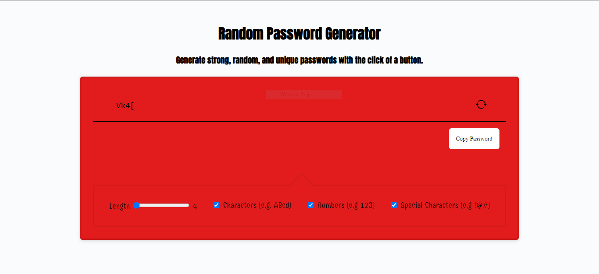

# JP-Password-generator

## User Story

When the user lands on the webpage, a 4 character password will be created and the user will have the ability to copy that password directly. The user will have the ability to change the password character length between 4 and 128 using a range slider. Other password options for the user also include - including or excluding letters, special characters, and numbers. If the user does not like the password generated they can change the password using the refresh button and a new password will be created for the user. A copy password button is also implemented so the user can copy the newly generated password directly to their clipboard. Other important features include dynamically changing css using javascript. The webpage automatically changes the background color based on the character limit. Character limits 4 to 7 are red, 7 to 9 are orange, and 9 to 128 are green. Furthermore, different character types are separated using their font color to increase readability.

## Technologies Used

HTML, CSS, JAVASCRIPT

## Application Link:

[Jp Password Generator](https://jukphillips.github.io/password-generator/)

## Image of Deployed Application

